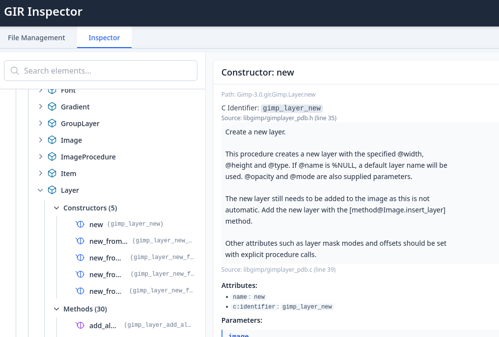

# GIR inspector

I asked Gemini pro 2.5 to make me an Intellij plugin to inspect GIR files. It's reply:

> I will help you create a web app to display GIR files. Here is a react web app that can parse...

However, it did in fact almost one-shot parsing the GIR xml format, and come up with
a nice little GUI for displaying the results.

If you have a need to quickly inspect a library that has a Gobject introspection file,
then you can use the app here <https://tolland.github.io/react-gir-inspector/>

## Run Locally

**Prerequisites:**  Node.js

1. Install dependencies:
   `pnpm install`
2. Run the app:
   `npm run dev`
